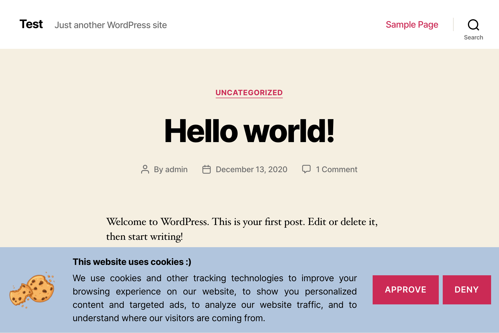
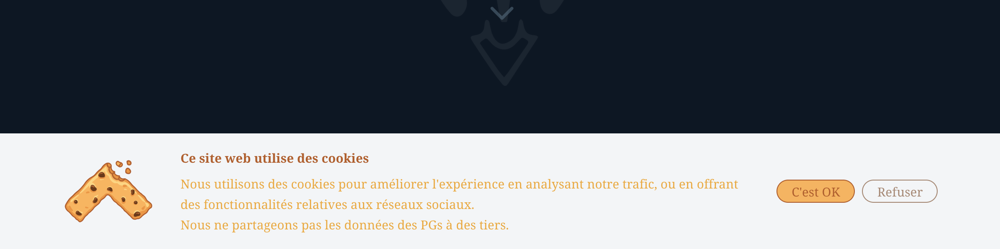

# Can I Use Cookies ? WordPress plugin


WordPress plugin that does one thing but does it right:

**Ask the user for his consent about cookies and tracking.**

## Features

- Display a popup on every page and ask the user for his consent about tracking
- "Approve" and "Deny" button: compliant with GDPR and CCPA
- Customisable texts and image on the popup  
- Customisable style of the popup using CSS
- Available in 2 languages: English and French
- No branding, no ad on the admin panel. Just a new menu in the settings.

## How it works ?

The plugin will add a new menu under your settings, where you can set up the various texts and images used by the popup.
Then, a popup will appear on every public pages, asking the user for his consent about cookies and tracking, presenting him with 2 choices:

- **Approve**: Set a cookie `cookie-consent=yes` valid for 6 months
- **Deny**: Set a cookie `cookie-consent=no` valid for 6 months

It's then up to you, and your analytics solution, to check for the `cookie-consent` value and handle it according to the user's wishes.

## How to customize the popup style ?

A default style is applied to the popup, with the strict minimum (the layout of the popup).
The popup will inherit the text style, button style and colors from your theme.

However, you can use CSS to customize the popup layout and style
(by enqueuing a stylesheet in your `functions.php` file, add additional CSS in your theme's options,
or whatever technique to add CSS to your page).

For reference, here is the popup HTML code. You can use the main container id (`#can-i-use-cookies`)
to scope your CSS rules.

```html
<div id="can-i-use-cookies">
    <div class="container">
        <div class="subcontainer">
            
            <div class="text-container">
                <p class="title">...</p>
                <p class="description">...</p>
            </div>
        </div>
        <div class="button-bar">
            <button id="can-i-use-cookies-yes" class="button">...</button>
            <button id="can-i-use-cookies-no" class="button">...</button>
        </div>
    </div>
</div>
```

## Screenshots

Check other screenshots in the [`assets/`](./assets) folder.




## Developers

This plugin is build using node and webpack to produce an optimized JS code. Once built, the plugin
is available under the `build/` directory.

### Requirements

- Node & yarn
- WP-CLI (for generation of translation files)
- gettext (for build of binary translation files)
  
### How to use

- Install dependencies
```shell
yarn run install
```

- Build the plugin
```shell
yarn run build
```

- Test locally the plugin using docker-compose (available at [localhost:8080](http://localhost:8080))
```shell
yarn run test
```

## License

WordPress requires that all plugins should be under a GPLv2+ compliant license.

This code is distributed under the GPLv3 or later license.
